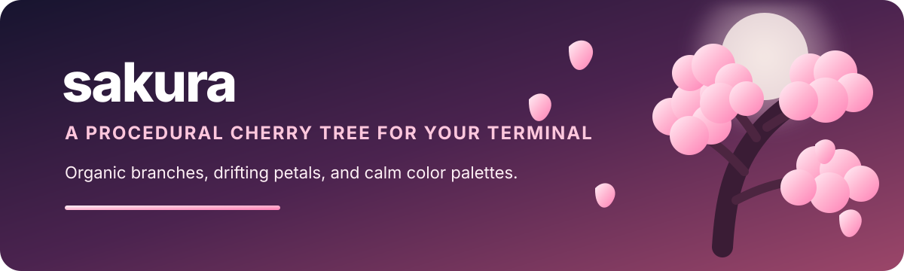

<p align="center">
  
</p>

<p align="center">
  <a href="https://github.com/madebycli/sakura/actions/workflows/ci.yml"></a>
  
  
  
</p>

<p align="center">
  A living cherry tree for Unix-like terminals, drawn fresh every time it grows.
</p>

`sakura` is a single-file Python terminal animation with procedural branches, layered blossoms, falling petals, responsive resizing, and a collection of carefully tuned color palettes.

It uses only the Python standard library at runtime. There is no network access, telemetry, subprocess launcher, or persistent application state.

## Quick start

Run with Nix:

```bash
nix run github:madebycli/sakura
```

Run directly from a checkout:

```bash
python3 sakura.py
```

Install into the current Nix profile:

```bash
nix profile add github:madebycli/sakura#sakura
sakura
```

## Highlights

- Procedural tree structure with an organic, responsive canopy
- Animated two-cell petals with configurable density and wind
- Unicode and ASCII rendering modes
- Fifteen built-in color palettes
- Deterministic scenes through `--seed`
- Clean terminal restoration on exit, resize, signals, and errors
- One Python source file and zero runtime package dependencies
- Nix and Arch Linux packaging

## Usage

```text
sakura [OPTIONS]

-f, --fps FPS          frame rate from 5 to 60
-p, --density N        petal density from 1 to 10
-w, --wind N           wind strength from 0 to 10
-c, --palette NAME     select a color palette
-a, --ascii            use ASCII-only glyphs
    --seed INTEGER     use a deterministic scene seed
    --self-test        run non-interactive integrity checks
-v, --version          print the version
-h, --help             show help
```

Examples:

```bash
sakura --palette lavender --density 8
sakura --wind 3 --fps 30
sakura --ascii --palette ink
sakura --seed 42
```

## Controls

| Key | Action |
|:---:|---|
| `q`, `Q`, `Esc` | Quit |
| `r`, `R` | Grow a new tree |
| `c` | Next palette |
| `C` | Previous palette |

## Palettes

```text
sakura  rose  blush  magenta  peach
coral   sunset  gold  lavender  violet
sky     mint  matcha  white  ink
```

## NixOS

```nix
{
  inputs.sakura.url = "github:madebycli/sakura";

  environment.systemPackages = [
    inputs.sakura.packages.${pkgs.system}.sakura
  ];
}
```

The flake supports `x86_64-linux` and `aarch64-linux` and exports packages, apps, checks, and a development shell.

## Python wheel

Build and install the standard Python package:

```bash
python3 -m build --wheel --no-isolation
python3 -m pip install dist/*.whl
sakura --self-test
```

The installed command is `sakura`.

## Arch Linux

```bash
cd packaging/arch
makepkg --syncdeps --cleanbuild
sudo pacman -U ./sakura-*.pkg.tar.zst
```

## Development

```bash
nix develop
python3 -m unittest discover -s tests -v
python3 sakura.py --self-test
ruff check .
nix flake check --print-build-logs
nix build .#sakura --print-build-logs
```

The test suite covers option validation, deterministic model behavior, terminal proportions, resize handling, low-color fallback, cleanup, Unicode and ASCII modes, packaging, and Nix builds.

## Origins and license

This Python rewrite is derived from [`csakura`](https://github.com/realstrawhat/csakura), created and maintained by [`realstrawhat`](https://github.com/realstrawhat). The original authorship and MIT license remain preserved.

See [`LICENSE`](LICENSE) for the complete license text.
